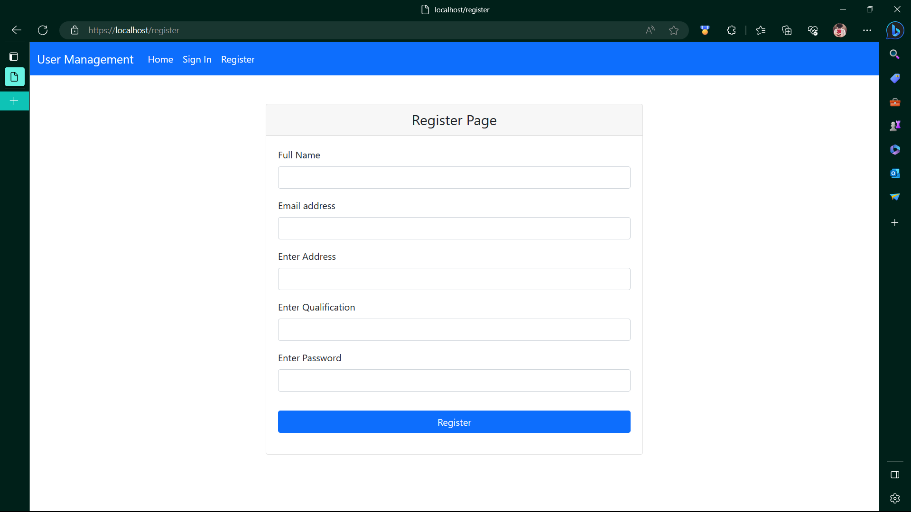

# user_managment_app_SpringBoot

An User Managment App in Spring Boot

<h3>Tech Used<h3>
  <ul>
    <li>JAVA 17</li>
    <li>Spring Boot 3.0.7</li>
    <li>Spring Security</li>
    <li>Thymeleaf</li>
    <li>BootStrap5</li>
    <li>MySQL</li>
  </ul>

  <h3>HOME PAGE</h3>
  
  
  <h3>SIGN IN</h3>
  
  
  <h3>FORGET</h3>
  
  
  <h3>REGISTER</h3>
  
  
  
  <h3>USER VALIDATION</h3>
   
  
   
